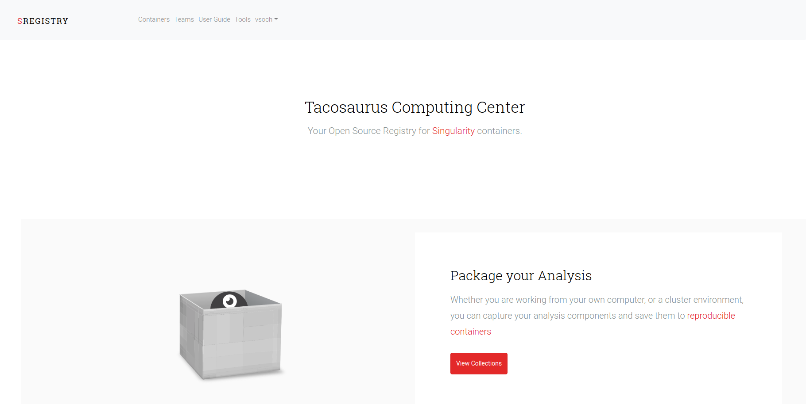
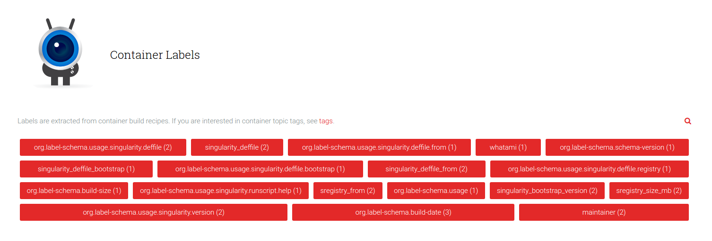
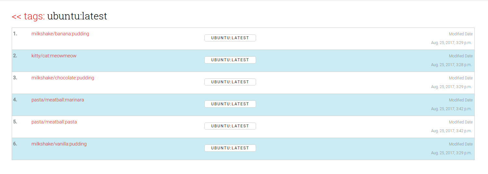

# Introduction

## A Need for Reproducible Science

Using computational methods to answer scientific questions of interest is an important task to increase our knowledge about the world. Along with careful assembly of protocol and relevant datasets, the scientist must also write software to perform the analysis, and use the software in combination with data to answer the question of interest. When a result of interest to the larger community is found, the scientist writes it up for publication in a scientific journal. This is what we might call a single scientific result.

Replication of a result would increase our confidence in the finding. The extent to which a published finding affords a second scientist to repeat the steps to achieve the result is called reproducibility. Reproducibility, in that it allows for repeated testing of an interesting question to validate knowledge about the world, is a foundation of science. While the original research can be an arduous task, often the culmination of years of work and committment, attemps to reproduce a series of methods to assess if the finding replicates is equally challenging. The researcher must minimally have enough documentation to describe the original data and detailed methods to put together an equivalent experiment. A comparable computational environment must then be used to look for evidence to assert or reject the original hypothesis.

Unfortunately, many scientists are not able to provide the minimum product to allow others to reproduce their work. It could be an issue of time - the modern scientist is burdened with writing grants, managing staff, and fighting for tenure. It could be an issue of education. Graduate school training is heavily focused on a particular domain of interest, and developing skills to learn to program, use version control, and test is outside the scope of the program. It might also be entirely infeasible. If the experiments were run on a particular supercomputer and/or with a custom software stack, it is a non trivial task to provide that environment to others. The inability to easily share environments and software serves as a direct threat to scientific reproducibility.

[](https://doi.org/10.21105/joss.00426)



## Encapsulation of Environments with Containers

The idea that the entire software stack, including libraries and specific versions of dependencies, could be put into a container and shared offered promise to help this problem. Linux containers, which can be thought of as encapsulated environments that host their own operating systems, software, and flie contents, were a deal breaker when coming onto the scene in early 2015. Like Virtual Machines, containers can make it easy to run a newer software stack on an older host, or to package up all the necessary software to run a scientific experiment, and have confidence that when sharing the container, it will run without a hitch. In early 2015, an early player on the scene, an enterprise container solution called Docker, started to be embraced by the scientific community. Docker containers were ideal for enterprise deployments, but posed huge security hazards if installed on a shared resource.

It wasn't until the introduction of the Singularity software that these workflows could be securely deployed on local cluster resources. For the first time, scientists could package up all of the software and libraries needed for their research, and deliver a complete package for a second scientist to reproduce the work. Singularity took the high performance computing world by storm, securing several awards and press releases, and within a year being installed at over 45 super computing centers across the globe. 

## Singularity Registry Server

Singularity Registry Server is a Dockerized web application that an institution or individual can deploy to organize and manage Singularity images. After you [install](install) and [setup](setup) your registry, you are welcomed with the home screen. In this case, our institution is called "Tacosaurus Computing Center":

<br>


<br>
You can log in via the social backends that you've configured, in this case, the default is Twitter because it has the easiest setup:
<br>


<br>
And your registry "About" page is specific to your group, meaning a customized contact email and help link:
<br>


<br>
And you can quickly glimpse at the names, links, and relative sizes for all containers in the registry:
<br>


Enough screen shots! Let's get familiar first with some of the basics.


## How are images named?
When you deploy your registry, it lives at a web address. On your personal computer, this would be localhost (127.0.0.1), and on an institution server, it could be given its own domain or subdomain (eg, `containers.stanford.edu`). This means that, for example, if you had a container called `science/rocks` with tag `latest`, and if you wanted to pull it using the [Singularity software](singularity-client.md), the command would be:

```bash
$ singularity pull shub://127.0.0.1/science/rocks:latest
```

If you use the [sregistry software](/sregistry/client) (the main controller that is configured for a specific registry) then you don't need to use the domain, or the `shub://` uri.

```bash
$ sregistry pull science/rocks:latest
```

The name space of the uri (e.g., `/science/rocks:latest`) is completely up to you to manage. Here are a few suggestions for a larger cluster or institution:

 - `[ cluster ]/[ project ]`
 - `[ group ]/[ project ]`
 - `[ user ]/[ project ]`

For a personal user, you could use software categories or topics:

 - `[ category ]/[ software ]`
 - `[ neuroimaging ]/[ realign ]`

Singularity Hub, based on its connection with Github, uses `[ username ]/[ reponame ]`. If you manage repositories equivalently, you might also consider this as an idea. The one constaint on naming is that only the special character `-` is allowed, and all letters are automatically made lowercase. There are fewer bugs that way, trust us.

## How are images shared?

Akin to Singularity Hub, you share your images by making your registry publicly accessible (or some images in it) and then others can easily download your images with the pull command.

```bash
$ singularity pull shub://127.0.0.1/science/rocks:latest # localhost
```

You can also generate an expiring link for a user to download the image equivalently:
<br>


## Terms
Let's now talk about some commonly used terms.

### registry
The registry refers to this entire application. When you set up your registry, you will fill out some basic information in settings, and send it to Singularity Hub. When we have a few registries running, we will have a central location that uses endpoints served by each to make images easily findable.


### collections
Each container image (eg, `shub://fishman/snacks`) is actually a set of images called a `collection`. This is the view looking at all collections in a registry:

<br>


<br>
Within a collection you might have different tags or versions for images. For example:

 - `milkshake/banana:pudding`
 - `milkshake/chocolate:pudding`
 - `milkshake/vanilla:pudding`

All of these images are derivations of `milkshake`, and so we find them in the same collection. I chose above to change the name of the container and maintain the same tag, you could of course have more granular detail, different versions of the same container:

 - `milkshake/banana:v1.0`
 - `milkshake/banana:v2.0`

### Labels

A `label` is an important piece of metadata (such as version, creator, or build variables) that is carried with a container to help understand it's generation, and organize it. When you create a Singularity image, you might bootstrap from Docker, and or add a "labels" section to your build definition:

```bash
%labels
MAINTAINER vanessasaur
```

The registry automatically parses these labels, and makes them searchable for the user.
<br>

<br>
When you investiage an individual label, you can see all containers in the registry that have it! For example, here I reveal that my testing images are in fact the same image named differently, or at least they have two unique sizes:
<br>


### Topic Tags

Topic tags are a way for users to (after build, within the Registry) add "topic words" to describe containers. They are searchable in the same way that labels are:
<br>

<br>
While a label may be something relevant to the build environment, a topic tag is more something like "biology" or the operating system. For example, if you look at the single container view, the Singularity Registry automatically parses the "From" statement to create a topic for each operating system type:
<br>

<br>
Notably, if you are logged in, you can dynamically click and write in a new tag for the container, and it is automatically saved.


### Favorites
Do you have a favorite collection? You can star it! Each Singularity Registry keeps track of the number of downloads (pull) of the containers, along with stars! Here we see the number of stars for our small registry:
<br>

<br>

and equally, container downloads:
<br>

<br>
If there is other metadata you would like to see about usage, please let me know.
